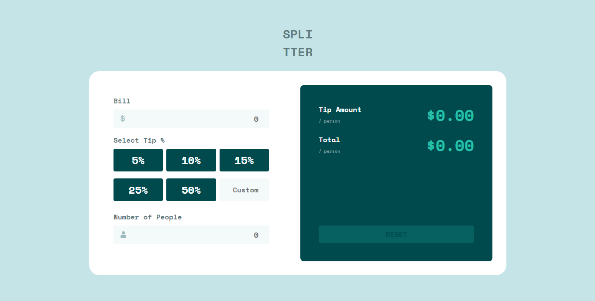

# Tip calculator app

Esta é uma solução para o [desafio Tip calculator app do Frontend Mentor](https://www.frontendmentor.io/challenges/tip-calculator-app-ugJNGbJUX).

## Conteúdos

- [Desafio](#desafio)
- [Screenshot](#screenshot)
- [Links](#links)
- [Tecnologias](#tecnologias)
- [Autor](#autor)

### Desafio

Os usuários devem ser capazes de:

- Visualize o layout ideal do aplicativo, dependendo do tamanho da tela do dispositivo.
- Ver os estados de foco para todos os elementos interativos na página.
- Calcular a gorjeta correta e o custo total da conta por pessoa

### Screenshot

### Links

- Repositório: [Github](https://github.com/PHnrq/tip-calculator-app)
- Live Site: [Tip Calculator](https://tip-calculator-app-beige-delta.vercel.app/)

### Tecnologias

- HTML5
- CSS3
- Flexbox
- CSS Grid
- Mobile-first workflow
- [React](https://reactjs.org/)
- [Styled Components](https://styled-components.com/)

## Autor

- LinkedIn - [Paulo Figuerêdo](https://www.linkedin.com/in/paulo-figueredo/)
